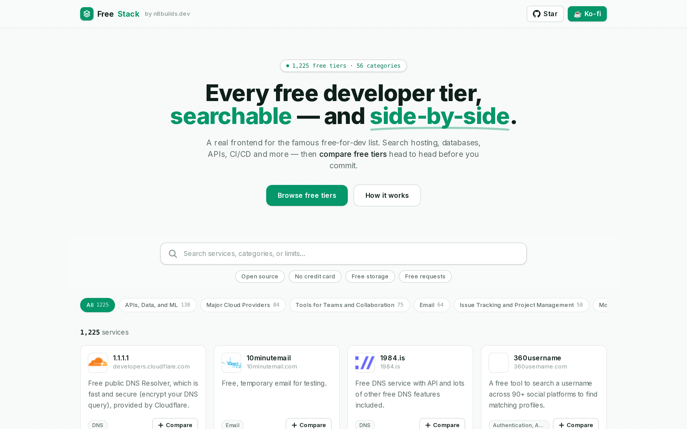
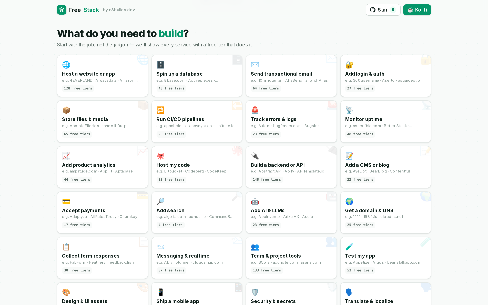
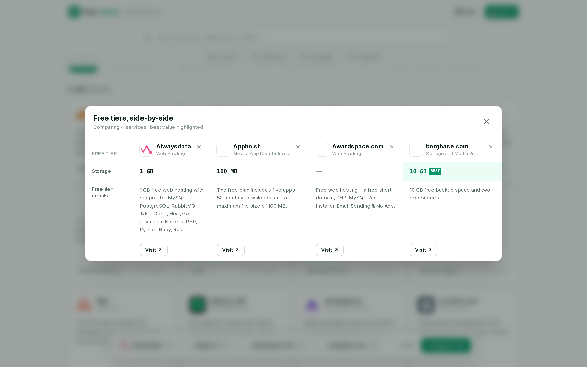

# FreeStack

**Every free developer tier, searchable — and side-by-side.**

FreeStack is a fast, free, open-source frontend for the famous
[ripienaar/free-for-dev](https://github.com/ripienaar/free-for-dev) list — 1,200+
services that offer a genuine free tier for developers. Browse by **what you need
to build** ("a database", "send email", "add logins") instead of tech jargon,
then **compare 2–4 free tiers head-to-head** in a clean side-by-side table before
you commit.

> 🔧 **How it works:** see [HOW_IT_WORKS.md](./HOW_IT_WORKS.md) for the architecture, data pipeline, and internals.

🌐 **Live: [freestack-livid.vercel.app](https://freestack-livid.vercel.app)** · ⭐ [Star on GitHub](https://github.com/n8watkins/freestack)
· ☕ [Support on Ko-fi](https://ko-fi.com/n8watkins)



## Why

The free-for-dev list is one of the best community resources on the internet —
1,600+ contributors, thousands of services with real free tiers. But it's a
giant alphabetical README. You can't search it, you can't filter it, and you
definitely can't line up four hosting providers and see which gives you the most
free storage.

FreeStack fixes that:

- **🎯 Goal-first browsing** — start from the job, not the jargon. 24 goals
  ("Host a website", "Spin up a database", "Send transactional email", "Add login
  & auth") each map to every free tier that does it, so you don't need to know
  whether the thing you want is filed under "BaaS", "PaaS", or "Managed Data
  Services."
- **Instant search** — type a service, category, or a limit ("10GB", "no credit
  card") and the directory filters as you type. Fully keyboard-accessible.
- **Category + facet filters** — 56 categories plus structured toggles (open
  source, no credit card, free storage, free requests) parsed straight from each
  service's free-tier description.
- **Compare free tiers side-by-side** — the headline feature. Pick 2–4 services
  and FreeStack lays their free tiers out as a table: storage, bandwidth,
  requests/month, build minutes, seats, projects — with the **best value in each
  row highlighted** so the winner is obvious at a glance.
- **Freshness signal** — every build stamps the date the data was last verified
  against the upstream list.





## How it works

FreeStack is **static-first** — there's no database and no server-side rendering
of the directory. A build-time pipeline does all the heavy lifting:

1. **Fetch** the raw `free-for-dev` README from GitHub.
2. **Parse** it into structured records — `{ name, url, domain, category,
   description, freeTierNotes }` — handling both top-level service bullets and
   the nested per-product bullets under the major cloud providers.
3. **Enrich** each service with a logo (via [icon.horse](https://icon.horse),
   falling back to Google's favicon service, then a tinted monogram) and
   best-effort **structured facets** extracted from the free-tier prose
   (storage in GB/TB, requests/month, seats, projects, build minutes, and
   boolean flags like open-source / no-credit-card).
4. **Bake** everything to a committed `data/services.json` so production builds
   are reproducible and need zero network calls.

The frontend (Next.js App Router, React 19, Tailwind v4, Framer Motion) reads
that JSON and runs all search, filtering, and comparison **client-side**.

```bash
npm install
npm run data    # rebuild data/services.json from the upstream list
npm run dev     # → http://localhost:7693
npm run build   # typecheck + production build
npm run shot    # capture README screenshots via Playwright (dev/prod server must be running)
```

## Tech

- **Next.js 15** (App Router) + **React 19** + **TypeScript**
- **Tailwind CSS v4** — a light "pricing-page" aesthetic with an emerald accent
  and a number-friendly monospace for free-tier limits
- **Framer Motion** for entrance and layout animations
- No runtime database — deploys clean to the Vercel free tier
- Rich SEO: Open Graph + Twitter cards, generated OG image, `sitemap.ts`,
  `robots.ts`, and JSON-LD

## Data & credit

All service data comes from
[**ripienaar/free-for-dev**](https://github.com/ripienaar/free-for-dev) by
R.I. Pienaar and 1,600+ contributors — please go star the original list, it's
the source of truth and the reason this project can exist. FreeStack re-presents
that data with a searchable frontend and a comparison tool; it does not modify or
re-host the upstream content beyond parsing it into JSON.

Found a service with stale limits or want one added? Contribute it
[upstream](https://github.com/ripienaar/free-for-dev) and it'll flow into
FreeStack on the next data sync.

## Support

If FreeStack saved you time, you can [support it on Ko-fi](https://ko-fi.com/n8watkins). ☕

Need something like this built for your own data? [Appturnity](https://appturnity.com)
ships clean, fast web apps — [let's talk](https://appturnity.com).

## License

[MIT](./LICENSE) © 2026 Nathan Watkins · built by
[Nate · n8builds.dev](https://n8builds.dev)
